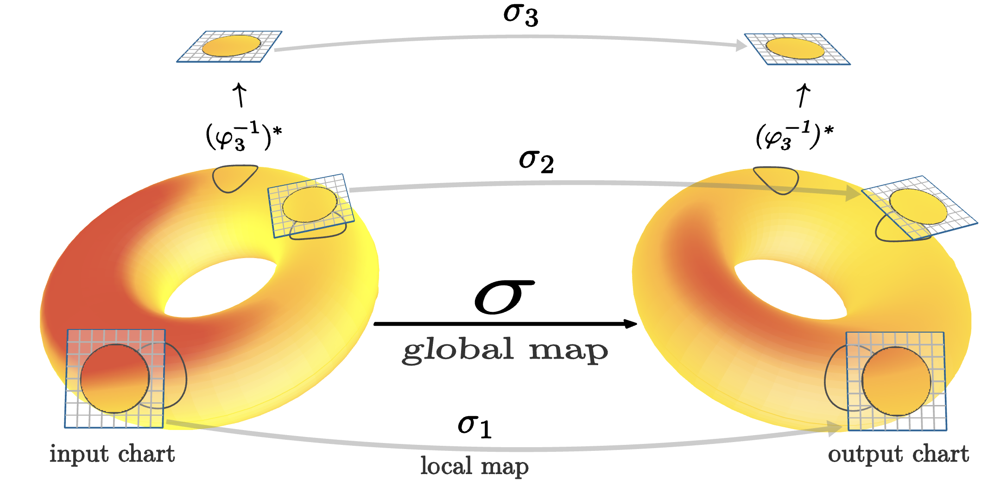

# Local Symmetry Discovery



## Installation

After (optionally) setting up a virtual environment, run:
```
pip install -r requirements.txt
```

## Running Experiments
For all experiments, if you already have a good predictor from a previous run, you can use the flag `--reuse_predictor` to avoid having to retrain a new one.

### Top Tagging

Download dataset from [here](https://zenodo.org/record/2603256) to `data/top-tagging`.

Discover Lie algebra. You can optionally use the `--standard_basis` flag to report results in standard form. However, this sometimes produces duplicate generators.
```
python3 experiment_toptagging.py --task discover_algebra --epochs 10
```
expected results: so(1, 3) basis with possibly an additional scaling generator.

After discovering Lie algebra (and more importantly, having a good predictor), you can discover the various cosets
```
python3 experiment_toptagging.py --task discover_cosets --epochs 3 --reuse_predictor
```
expected results: two reported cosets: identity and parity representatives.

Alternatively, you can discover both in one go. The downside is that the epoch count is the same for both so the cosets portion may take a while.
```
python3 experiment_toptagging.py --task discover --epochs 10
```

To run the downstream tasks, we refer to [LieGAN](https://github.com/Rose-STL-Lab/LieGAN).

### MNIST
Dataset should be downloaded automatically upon first run.

Discover Lie algebra
```
python3 experiment_mnist.py --task discover --epochs 10
```
expected results: generator of so(2).

Use LieGAN to attempt to discover global symmetry
```
python3 experiment_mnist.py --task liegan_discover --epochs 10
```
expected results: failure to converge to anything non-trivial. We do note that occasionally LieGAN will report a non-trivial generator. However, even in such cases the generator loss is extremely high which suggests that the GAN converges on this result to optimize the regularization rather than to fool the discriminator

Run baseline CNN with no equivariance
```
python3 experiment_mnist.py --task downstream_baseline --epochs 100 
```
expected results: test accuracy of around ~70%.

Run downstream CNN that uses the discovered atlas equivariance group
```
python3 experiment_mnist.py --task downstream_discovered --epochs 100 
```
expected results: test accuracy of around ~94%.

### Climate

Download dataset from [here](https://portal.nersc.gov/project/ClimateNet/climatenet_new/). Put into `data/climate/{train,test}` directory

Discover Lie Algebra (optionally use `--standard_basis` flag)
```
python3 experiment_climate.py --task discover --epochs 30
```
expected results: 4 dimensional Lie algebra with no major bias in any direction

Run baseline gauge equivariant CNN with SO(2) gauge group:
```
python3 experiment_climate.py --task downstream_baseline --epochs 20 --batch_size 4
```
expected results: roughly 0.48 mean iou

Run downstream gauge equvariant CNN with GL+(2) gauge group (in reality it's not perfectly GL+(2), but instead uses uniform kernels, which is the closest one can get to GL+(2) steerable kernels):

```
python3 experiment_climate.py --task downstream_discovered --epochs 20 --batch_size 4
```
expected results: roughly 0.48 mean iou (essentialy comparable performance to baseline, with 7x less parameters).

### PDE

Discover cosets
```
python3 experiment_pde.py --task discover_cosets --epochs 30
```

expected results: 4 cosets: identity, reflection across x, reflection across y, reflection across origin.
