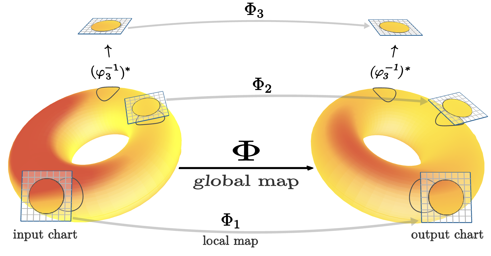

# AuTomatic LocAl Symmetry Discovery (AtlasD)



## Installation

After (optionally) setting up a virtual environment, run:
```
pip install -r requirements.txt
```

## Running Experiments
For all experiments, if you already have a good predictor from a previous run, you can use the flag `--reuse_predictor` to avoid having to retrain a new one.

### Top Tagging

Download dataset from [here](https://zenodo.org/record/2603256) to `data/top-tagging`.

Discover Lie algebra. You can optionally use the `--standard_basis` flag to report results in standard form. However, this sometimes produces duplicate generators.
```
python3 experiment_toptagging.py --task discover_algebra --epochs 10 --fixed_seed
```
expected results: so(1, 3) basis with possibly an additional scaling generator.

After discovering Lie algebra (and more importantly, having a good predictor), you can discover the various cosets.
```
python3 experiment_toptagging.py --task discover_cosets --epochs 3 --reuse_predictor --fixed_seed
```
expected results: two reported cosets: identity and parity representatives.

Alternatively, you can discover both in one go. The downside is that the epoch count is the same for both so the cosets portion may take a while.
```
python3 experiment_toptagging.py --task discover --epochs 10 --fixed_seed
```

To run the downstream tasks, we refer to [LieGAN](https://github.com/Rose-STL-Lab/LieGAN).

### PDE
Dataset is simulated on demand and nothing needs to be downloaded.

Discover algebra
```
python3 experiment_pde.py --task discover_algebra --epochs 10 --fixed_seed
```
expected results: so2 generator.

Discover cosets
```
python3 experiment_pde.py --task discover_cosets --epochs 10 --fixed_seed
```
expected results: 2 cosets: identity and reflection.

By default the first atlas (19 charts) is used. To use the second atlas (3 charts) instead, pass ```--atlas 2``` to either command.

### MNIST
Dataset should be downloaded automatically upon first run.

Discover Lie algebra
```
python3 experiment_mnist.py --task discover --epochs 10 --fixed_seed
```
expected results: generator of so(2).

Use SO3LieGAN to attempt to discover global symmetry
```
python3 experiment_mnist.py --task liegan_discover --epochs 10 --fixed_seed
```
expected results: either trivial group (i.e. low magnitude) or random rotation. Generally, we observe the output is sensitive to the initial condition.

Run baseline CNN with no equivariance
```
python3 experiment_mnist.py --task downstream_baseline --epochs 100  --fixed_seed
```
expected results: test accuracy of around ~70%.

Run downstream CNN that uses the discovered atlas equivariance group
```
python3 experiment_mnist.py --task downstream_discovered --epochs 100  --fixed_seed
```
expected results: test accuracy of around ~94%.

### Climate

Download dataset from [here](https://portal.nersc.gov/project/ClimateNet/climatenet_new/). Put into `data/climate/{train,test}` directory

Discover Lie Algebra (optionally use `--standard_basis` flag)
```
python3 experiment_climate.py --task discover --epochs 30 --fixed_seed
```
expected results: 4 dimensional Lie algebra with no major bias in any direction.

Run baseline gauge equivariant CNN with SO(2) gauge group:
```
python3 experiment_climate.py --task downstream_baseline --epochs 20 --batch_size 4 --fixed_seed
```
expected results: roughly 0.48 mean iou.

Run downstream gauge equvariant CNN with GL+(2) gauge group (in reality it's not perfectly GL+(2), but instead uses uniform kernels, which is the closest one can get to GL+(2) steerable kernels):

```
python3 experiment_climate.py --task downstream_discovered --epochs 20 --batch_size 4 --fixed_seed
```
expected results: roughly 0.48 mean iou (essentialy comparable performance to baseline, with 7x less parameters).

### Custom Identity Component
When discovering cosets, the model must use an already discovered Lie algebra to determine the identity component. In our work, this is hard coded based on a result the authors ran manually. If you would like to use your own discovered version, replace the appropriate tensors (lines 160 and 196/199 respectively) in ```experiment_toptagging.py``` and/or ```experiment_pde.py```
